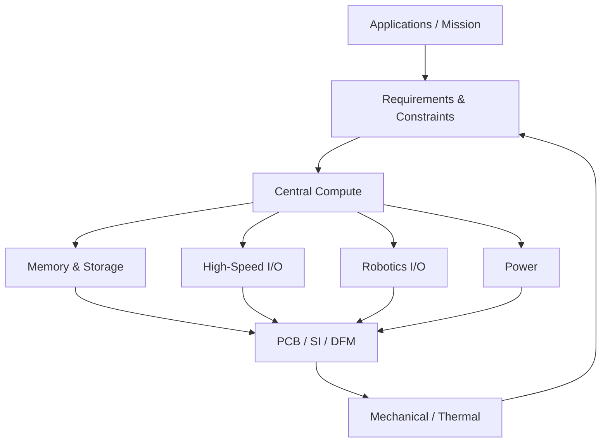

# Universal Robotics SoC

## Project Vision

A compact, reusable robotics compute platform intended to unify Linux application processing, real-time control, onboard AI / vision, robotics I/O, integrated sensing, high-speed connectivity, and wireless/IoT capability into a single reusable controller platform.

## Design Philosophy

**Ideally, we want the most performance whilst satisfying the constraints. The fundamental ideology in system design is how everything influences everything else.**

Requirements and constraints influence the choice of the central processing architecture — whether that is an MCU, MPU, SoC, FPGA, heterogeneous processor, or a combination of devices. At the same time, the selected central processor influences the requirements of every supporting subsystem.

Furthermore, **external peripherals and their protocol requirements** (e.g., LiDAR via Ethernet, high-res cameras via MIPI CSI, motor drivers via CAN-FD) dictate the necessary I/O on the board, which feeds directly back into the SoC selection constraints.

Engineering requirements force engineering trade-offs. The objective is therefore NOT:
*Pick the fastest processor.*

The objective is:
**Build the highest-performance complete system that satisfies the project requirements and constraints.**

## Why This Exists

Most robotics systems are built from multiple disconnected modules (SBC, MCU, sensor breakouts, motor controllers, etc.). This project aims to reduce fragmentation by exploring a **unified robotics controller architecture**.

## Target Applications

The goal is to design a platform capable of being adapted to applications such as:
- autonomous drones
- mobile robots
- robotic arms
- machine vision
- AI inference
- SLAM
- navigation
- ROS / ROS 2
- industrial automation
- embedded Linux development
- HMI systems
- sensor processing
- data acquisition
- general edge computing

## High-Level Architecture

## High-Level Requirements

| Category | Requirement |
|---|---|
| **Operating System** | Linux required |
| **RAM** | Absolute minimum 512 MB; preferred 2–8+ GB |
| **CPU** | Multi-core 64-bit application processor |
| **AI** | Hardware accelerator strongly preferred |
| **GPU** | Hardware graphics/compute preferred |
| **Real-Time** | Integrated RT core preferred; external MCU remains an option |
| **Storage** | eMMC preferred/required; NVMe/UFS desirable |
| **PCIe** | At least one interface strongly preferred |
| **USB** | USB 3.x strongly preferred |
| **Ethernet** | ≥1 GbE; multiple ports, TSN, 2.5/10GbE desirable |
| **CAN** | CAN-FD strongly preferred |
| **Camera** | MIPI CSI strongly preferred |
| **Display** | HDMI / DP / eDP / MIPI DSI desirable |
| **General I/O** | UART, SPI, I²C, GPIO, PWM |
| **Advanced I/O** | I³C, ADC, hardware timers/encoder interfaces desirable |
| **Power** | Low-power and high-performance operating modes desirable |
| **Mechanical** | Must remain usable in compact robotics applications including drones |
| **Manufacturing** | Avoid unnecessary PCB/HDI complexity |
| **Thermal** | Passive/modest cooling preferred where practical |
| **Documentation**| Good datasheet, reference manual, HW design guide and BSP strongly preferred |
| **Availability** | Critical ICs must be realistically purchasable |
| **Cost** | Must remain economically practical |
| **PCB** | Initial target approximately 6–10 layers, subject to SI requirements |

## Current Design Status

The project is currently in **Phase 2 — Select Processing Architecture**. 
Please see the [Decision Log](docs/decisions/decision-log.md) for ongoing architectural trade-offs.

## SoC Selection

The central compute selection drives the rest of the board architecture. For a detailed comparison and trade-offs of all candidates, see the [SoC Candidates Document](hardware/processing/soc-candidates.md).

**Current Strongest Candidates (Under Evaluation):**
- **Rockchip RK3576**
- **NXP i.MX 95**
- **Rockchip RK3588**
- **Renesas RZ/V2H**

*Note: The objective is not to build the most powerful processor board, but the highest-performance complete system that satisfies all requirements and constraints.*

## Repository Structure

- [docs/](docs/) - Architecture, Requirements, and Decisions
- [hardware/](hardware/) - Hardware Engineering Subsystems (Processing, Memory, Power, IO, PCB, Mechanical)
- [firmware/](firmware/) - Bootloaders and RTOS
- [linux/](linux/) - BSP, Device Trees, and Drivers
- [software/](software/) - Robotics and AI Tooling
- [simulation/](simulation/) - Hardware and Physics Simulations
- [test/](test/) - Bring-up and Validation
- [references/](references/) - Datasheets and Reference Manuals

## Development Roadmap

- **Phase 0** — Define Mission *(Complete)*
- **Phase 1** — Freeze High-Level Requirements *(In Progress)*
- **Phase 2** — Select Processing Architecture *(In Progress)*
- **Phase 3** — Select Memory / Storage
- **Phase 4** — Define Power Architecture
- **Phase 5** — Define External I/O
- **Phase 6** — Define Mechanical Form Factor
- **Phase 7** — Preliminary Stackup / SI Study
- **Phase 8** — Schematic Capture
- **Phase 9** — PCB Placement / Routing
- **Phase 10** — Design Review
- **Phase 11** — Fabrication / Assembly
- **Phase 12** — Power Bring-Up
- **Phase 13** — Bootloader / DDR Bring-Up
- **Phase 14** — Linux BSP Bring-Up
- **Phase 15** — Peripheral Validation
- **Phase 16** — AI / Robotics Software
- **Phase 17** — System Validation

## Documentation

- [Architecture Overview](docs/architecture/system-overview.md)
- [System Requirements](docs/requirements/system-requirements.md)
- [Decision Log](docs/decisions/decision-log.md)

## Contributing / Development Notes
*TBD*
