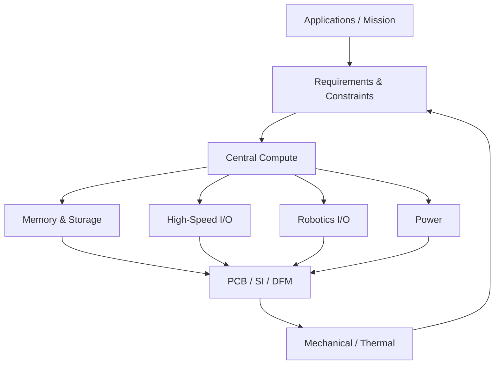

# Universal Robotics SoC


## Project Vision

A compact, reusable robotics compute platform intended to unify Linux application processing, real-time control, onboard AI / vision, robotics I/O, integrated sensing, high-speed connectivity, and wireless/IoT capability into a single reusable controller platform.

## Design Philosophy

**Ideally, we want the most performance whilst satisfying the constraints. The fundamental ideology in system design is how everything influences everything else.**

Requirements and constraints influence the choice of the central processing architecture — whether that is an MCU, MPU, SoC, FPGA, heterogeneous processor, or a combination of devices. At the same time, the selected central processor influences the requirements of every supporting subsystem.

Furthermore, **external peripherals and their protocol requirements** (e.g., LiDAR via Ethernet, high-res cameras via MIPI CSI, motor drivers via CAN-FD) dictate the necessary I/O on the board, which feeds directly back into the SoC selection constraints.

**Selecting Supporting ICs & Mitigating Trade-offs:**
Just as the SoC is chosen based on requirements, the supporting ICs (power, memory, IO expanders) are strictly chosen based on the SoC's demands *and* the mechanical/cost constraints.

Engineering requirements force engineering trade-offs. The objective is therefore NOT:
*Pick the fastest processor.*

The objective is:
**Build the highest-performance complete system that satisfies the project requirements and constraints.**

## Why This Exists

Most robotics systems are built from multiple disconnected modules (SBC, MCU, sensor breakouts, motor controllers, etc.). This project aims to reduce fragmentation by exploring a **unified robotics controller architecture**.

## Target Applications

The goal is to design a platform capable of being adapted to applications such as:
- autonomous drones
- mobile robots
- robotic arms
- machine vision
- AI inference
- SLAM
- navigation
- ROS / ROS 2
- industrial automation
- embedded Linux development
- HMI systems
- sensor processing
- data acquisition
- general edge computing

## Locked Processor

**STM32MP257FAI3** — STMicroelectronics  
Dual Cortex-A35 (Linux) · Cortex-M33 (real-time) · 1.35 TOPS NPU · GPU / ISP  
TFBGA436 · 18 mm × 18 mm · 0.8 mm pitch

## High-Level Architecture



## Engineering Navigation

| Section | Description | Link |
|---------|-------------|------|
| **ARCHITECTURE** | System block diagrams, power architecture, peripheral design | [docs/architecture/](docs/architecture/) |
| **REQUIREMENTS** | Mission parameters and system constraints | [docs/requirements/](docs/requirements/) |
| **CUBEMX** | STM32CubeMX configuration guide and resource allocation | [CubeMX Guide](docs/architecture/cubemx-configuration-guide.md) |
| **POWER** | Power tree, battery input, source selection, actuator pass-through | [Power Architecture](docs/architecture/power-architecture.md) |
| **SENSORS** | IMU, magnetometer, barometer, GNSS architecture | [Sensor I/O](docs/architecture/sensor-io-architecture.md) |
| **INDUSTRIAL I/O** | RS-485, IO-Link, 24V I/O, isolated CAN | [Industrial I/O](docs/architecture/industrial-io.md) |
| **COMPONENTS** | Engineering cards for every major IC | [docs/components/](docs/components/) |
| **CALCULATIONS** | Design calculations: power, PDN, regulators, protection, high-current | [docs/calculations/](docs/calculations/) |
| **SIMULATIONS** | Simulation framework: power, SI, PI, thermal | [hardware/simulations/](hardware/simulations/) |
| **PCB / SI / PI** | Stackup, impedance, vias, return paths, fiber weave | [docs/pcb-si-pi/](docs/pcb-si-pi/) |
| **THERMAL** | Thermal budget, SoC cooling, regulator/connector thermal | [docs/thermal/](docs/thermal/) |
| **BRING-UP** | Power, DDR, boot, peripheral, RF bring-up procedures | [docs/bringup/](docs/bringup/) |
| **DECISIONS** | Architectural Decision Records (ADRs) | [docs/decisions/](docs/decisions/) |
| **CONNECTORS** | Connector architecture and high-current study | [Connector Architecture](docs/architecture/connector-architecture.md) |

## Current Design Status

The project has completed **Phase 2 — Select Processing Architecture**, pivoting from the i.MX 95 to officially lock in the **STMicroelectronics STM32MP257**.
We are now verifying the hardware architecture in STM32CubeMX before moving into hardware schematic capture based on the [Hardware Design Sequence](docs/architecture/hardware-design-sequence.md).
Please see the [Decision Log](docs/decisions/decision-log.md) for a record of the architectural trade-offs.

### Key Architecture Decisions

| Item | Status |
|------|--------|
| Processor: STM32MP257FAI3 | **LOCKED** |
| DDR: 4 GB LPDDR4 point-to-point x32 | **LOCKED** |
| eMMC: 64 GB | **LOCKED** |
| PCIe/USB3 COMBOPHY: assigned to PCIe Gen2 x1 | **LOCKED** |
| Battery input class: 2S–8S | **LOCKED** |
| Compute / actuator power split | **LOCKED** |
| Power architecture (discrete vs PMIC) | PROPOSED |
| PowerPath IC selection | PROPOSED |
| Actuator current specification | NEEDS CALCULATION |
| PCB stackup | PROPOSED — NEEDS JLCPCB VERIFICATION |
| Controlled impedance | NEEDS FABRICATOR CALCULATOR |
| PDN design | NEEDS SIMULATION |
| Regulator stability | NEEDS SIMULATION |
| Antenna geometry | NEEDS PCB OUTLINE + MEASUREMENT |
| CubeMX pin allocation | NEEDS CUBEMX VERIFICATION |

## Development Roadmap

- **Phase 0** — Define Mission *(Complete)*
- **Phase 1** — Freeze High-Level Requirements *(Complete)*
- **Phase 2** — Select Processing Architecture *(Complete)*
- **Phase 3** — Select Memory / Storage *(Complete)*
- **Phase 4** — Define High-Speed I/O (Ethernet, PCIe, USB, MIPI) *(Complete)*
- **Phase 5** — Define Robotics I/O (CAN-FD, Serial, PWM, I2C) *(Complete)*
- **Phase 6** — STM32CubeMX Platform Verification
- **Phase 7** — Define Power Architecture (Budgeting, Source Selection, Actuator Pass-Through)
- **Phase 8** — Define Mechanical Form Factor
- **Phase 9** — Preliminary Stackup / SI / PI Study
- **Phase 10** — Schematic Capture
- **Phase 11** — PCB Placement / Routing
- **Phase 12** — Design Review
- **Phase 13** — Fabrication / Assembly
- **Phase 14** — Power Bring-Up
- **Phase 15** — Bootloader / DDR Bring-Up
- **Phase 16** — Linux BSP Bring-Up
- **Phase 17** — Peripheral Validation
- **Phase 18** — AI / Robotics Software
- **Phase 19** — System Validation

*Note: For the detailed step-by-step schematic capture roadmap, see the [Hardware Design Sequence](docs/architecture/hardware-design-sequence.md).*

## SoC Selection

**Selected SoC: STMicroelectronics STM32MP257**
- **Specs:** Dual-core Cortex-A35, Cortex-M33, 1.35 TOPS Neural Processing Unit (NPU).
- **Why it was chosen (The Pivot):** We initially targeted NXP processors, but hit a hard NDA Wall and CDN firewalls that block open access to critical hardware routing guides. We pivoted to the STM32MP257 because it provides a complete robotics powerhouse paired with ST's legendary 100% public documentation and an inherently cheaper ecosystem.
- **Deep Dive:** See the [STM32MP257 System Architecture](docs/architecture/stm32mp25-system-design.md) for full implementation details.

For a detailed comparison of all evaluated candidates, see the [SoC Candidates Document](docs/decisions/soc-candidates.md).

## Repository Structure

```
universal-robotics-soc/
├── docs/
│   ├── architecture/         # System design, block diagrams, power architecture
│   ├── requirements/         # Mission parameters and constraints
│   ├── decisions/            # ADRs and component evaluation logs
│   ├── calculations/         # Design calculations (power, PDN, regulators, protection)
│   │   └── protection/       # Fuse, TVS, reverse polarity, surge protection
│   ├── components/           # IC engineering cards
│   ├── pcb-si-pi/            # Stackup, impedance, vias, return paths, SI/PI
│   ├── thermal/              # Thermal budget, cooling, validation
│   ├── bringup/              # Power, DDR, boot, peripheral bring-up
│   └── assets/               # SVG technical diagrams
├── hardware/
│   ├── stm32mp257/cubemx/    # STM32CubeMX project (.ioc under source control)
│   ├── power/simulations/    # Power simulation framework
│   └── simulations/          # SI, PI, thermal simulation roadmaps
├── linux/device-tree/        # Device tree overlays
└── references/datasheets/    # Component datasheets
```

## Contributing / Development Notes
*TBD*
