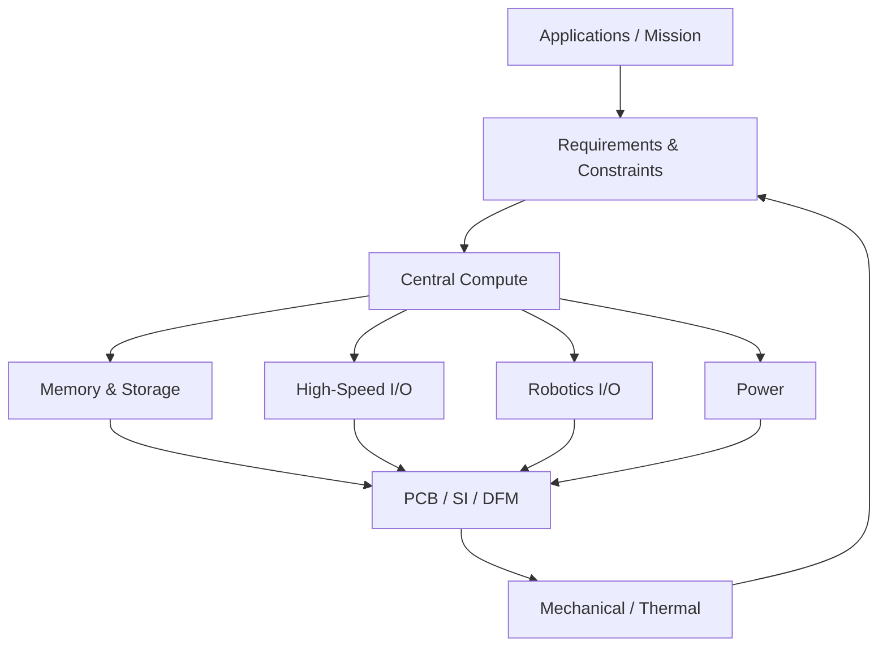

# Universal Robotics SoC

## Project Vision

A compact, reusable robotics compute platform intended to unify Linux application processing, real-time control, onboard AI / vision, robotics I/O, integrated sensing, high-speed connectivity, and wireless/IoT capability into a single reusable controller platform.

## Design Philosophy

**Ideally, we want the most performance whilst satisfying the constraints. The fundamental ideology in system design is how everything influences everything else.**

Requirements and constraints influence the choice of the central processing architecture — whether that is an MCU, MPU, SoC, FPGA, heterogeneous processor, or a combination of devices. At the same time, the selected central processor influences the requirements of every supporting subsystem.

Furthermore, **external peripherals and their protocol requirements** (e.g., LiDAR via Ethernet, high-res cameras via MIPI CSI, motor drivers via CAN-FD) dictate the necessary I/O on the board, which feeds directly back into the SoC selection constraints.

**Selecting Supporting ICs & Mitigating Trade-offs:**
Just as the SoC is chosen based on requirements, the supporting ICs (power, memory, IO expanders) are strictly chosen based on the SoC's demands *and* the mechanical/cost constraints. 
For example, an SoC may require multiple different voltage rails. A highly integrated PMIC (Power Management IC) might be the smallest solution, but if it is out of stock or too expensive, a trade-off is to use multiple discrete buck converters. To consolidate the Bill of Materials (BOM), we can use a "repeating supply" approach—using the exact same buck converter IC multiple times across the board, just adjusting the feedback resistors to output different voltages. While this adds slightly more hardware components (the trade-off), it significantly simplifies the supply chain, mitigates part-shortage risks, and lowers unit cost.

Engineering requirements force engineering trade-offs. The objective is therefore NOT:
*Pick the fastest processor.*

The objective is:
**Build the highest-performance complete system that satisfies the project requirements and constraints.**

## Why This Exists

Most robotics systems are built from multiple disconnected modules (SBC, MCU, sensor breakouts, motor controllers, etc.). This project aims to reduce fragmentation by exploring a **unified robotics controller architecture**.

## Target Applications

The goal is to design a platform capable of being adapted to applications such as:
- autonomous drones
- mobile robots
- robotic arms
- machine vision
- AI inference
- SLAM
- navigation
- ROS / ROS 2
- industrial automation
- embedded Linux development
- HMI systems
- sensor processing
- data acquisition
- general edge computing

## High-Level Architecture

## High-Level Requirements

| Category | Requirement |
|---|---|
| **Operating System** | Linux required |
| **RAM** | Absolute minimum 512 MB; preferred 2–8+ GB |
| **CPU** | Multi-core 64-bit application processor |
| **AI** | Hardware accelerator strongly preferred |
| **GPU** | Hardware graphics/compute preferred |
| **Real-Time** | Integrated RT core preferred; external MCU remains an option |
| **Storage** | eMMC required (64GB+) for OS; NVMe SSD supported via expansion slot |
| **PCIe** | Single Gen3 lane required. Must be routed to a modular M.2 slot for external AI accelerators, GPUs, or NVMe SSDs |
| **USB** | USB 3.0 strongly preferred |
| **Ethernet** | ≥1 GbE; multiple ports, TSN, 2.5/10GbE desirable |
| **CAN** | CAN-FD strongly preferred |
| **Camera** | MIPI CSI strongly preferred |
| **Display** | HDMI / DP / eDP / MIPI DSI desirable |
| **General I/O** | UART, SPI, I²C, GPIO, PWM |
| **Advanced I/O** | I3C, ADC, hardware timers/encoder interfaces desirable |
| **Power** | Low-power and high-performance operating modes desirable |
| **Mechanical** | Must remain usable in compact robotics applications including drones |
| **Manufacturing** | Avoid unnecessary PCB/HDI complexity |
| **Thermal** | Passive/modest cooling preferred where practical |
| **Documentation**| Good datasheet, reference manual, HW design guide and BSP strongly preferred |
| **Availability** | Critical ICs must be realistically purchasable |
| **Cost** | Must remain economically practical |
| **PCB** | Initial target approximately 6–10 layers, subject to SI requirements |

## Current Design Status

The project has completed **Phase 2 — Select Processing Architecture**, pivoting from the i.MX 95 to officially lock in the **NXP i.MX 8M Plus** due to documentation availability and native LCSC stock.
We are now moving into hardware schematic capture based on the [Hardware Design Sequence](docs/architecture/hardware-design-sequence.md).
Please see the [Decision Log](docs/decisions/decision-log.md) for a record of the architectural trade-offs.

## SoC Selection

The central compute selection drives the rest of the board architecture. 

**Selected SoC: NXP i.MX 8M Plus (MIMX8ML8CVNKZAB)**
- **Specs:** Quad-core Cortex-A53, Cortex-M7, 2.3 TOPS Neural Processing Unit (NPU).
- **Why it was chosen (The Pivot):** We initially targeted the successor (the i.MX 95), but hit a hard "NDA Wall". NXP restricts the hardware design guides for their newest processors behind corporate NDAs, making open-source hardware routing impossible. We pivoted to the i.MX 8M Plus because it still provides excellent robotics compute capabilities, but features **100% public documentation (no NDA required)** and is natively stocked at LCSC. The 0.5 mm pitch BGA can be routed on 6-layer boards using JLCPCB's free via-in-pad (POFV) technology.
- **Deep Dive:** See the [i.MX 8M Plus System Design & Block Diagram](docs/architecture/imx8mp-system-design.md) for full implementation details.

For a detailed comparison of all evaluated candidates, see the [SoC Candidates Document](hardware/processing/soc-candidates.md).

## Repository Structure

- [docs/](docs/) - Architecture, Requirements, and Decisions
- [hardware/](hardware/) - Hardware Engineering Subsystems (Processing, Memory, Power, IO, PCB, Mechanical)
- [firmware/](firmware/) - Bootloaders and RTOS
- [linux/](linux/) - BSP, Device Trees, and Drivers
- [software/](software/) - Robotics and AI Tooling
- [simulation/](simulation/) - Hardware and Physics Simulations
- [test/](test/) - Bring-up and Validation
- [references/](references/) - Datasheets and Reference Manuals

## Development Roadmap

- **Phase 0** — Define Mission *(Complete)*
- **Phase 1** — Freeze High-Level Requirements *(Complete)*
- **Phase 2** — Select Processing Architecture *(Complete)*
- **Phase 3** — Select Memory / Storage *(In Progress)*
- **Phase 4** — Define High-Speed I/O (Ethernet, PCIe, USB, MIPI)
- **Phase 5** — Define Robotics I/O (CAN-FD, Serial, PWM, I2C)
- **Phase 6** — Define Power Architecture (Budgeting, Consolidation, PMIC)
- **Phase 7** — Define Mechanical Form Factor
- **Phase 8** — Preliminary Stackup / SI Study
- **Phase 9** — Schematic Capture
- **Phase 10** — PCB Placement / Routing
- **Phase 11** — Design Review
- **Phase 12** — Fabrication / Assembly
- **Phase 13** — Power Bring-Up
- **Phase 14** — Bootloader / DDR Bring-Up
- **Phase 15** — Linux BSP Bring-Up
- **Phase 16** — Peripheral Validation
- **Phase 17** — AI / Robotics Software
- **Phase 18** — System Validation

*Note: For the detailed step-by-step schematic capture roadmap, see the [Hardware Design Sequence](docs/architecture/hardware-design-sequence.md).*

## Documentation

- [Architecture Overview](docs/architecture/system-overview.md)
- [System Requirements](docs/requirements/system-requirements.md)
- [Hardware Design Sequence](docs/architecture/hardware-design-sequence.md)
- [i.MX 8M Plus System Architecture](docs/architecture/imx8mp-system-design.md)
- [PCB Stackup & Impedance Constraints](docs/architecture/pcb-stackup-constraints.md)
- [Decision Log](docs/decisions/decision-log.md)

## Contributing / Development Notes
*TBD*
