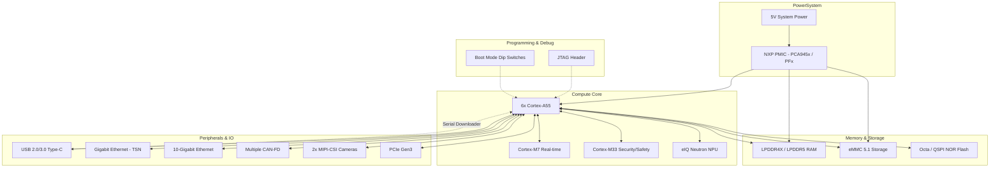

# NXP i.MX 95 System Architecture

## Part Selection
**Selected Part:** `MIMX9536CVZXNAC` (NXP i.MX 95)
- **Cores:** Hexa-core Arm Cortex-A55 @ 1.8 GHz
- **Real-Time Domains:** Cortex-M7 & Cortex-M33
- **NPU:** eIQ Neutron NPU (~2 TOPS)
- **Package:** 19 x 19 mm FC-PBGA
- **Pitch:** 0.7 mm
- **Temperature:** Industrial (-40°C to 105°C)

### Why This Was Chosen
We initially evaluated the i.MX 8M Plus, but pivoted to the i.MX 95 series to gain the modern Cortex-A55 architecture. Crucially, we specifically targeted the **"Z" package (19x19 mm)**. 
- **PCB Manufacturability:** The 19x19 mm package has a highly forgiving **0.7 mm BGA pitch**. Combined with JLCPCB's free Via-in-Pad (POFV) on 6-10 layer boards, routing this chip will be incredibly easy and won't require expensive High-Density Interconnect (HDI) manufacturing.
- **Performance:** It easily exceeds our robotics requirements with six A55 cores and dual real-time microcontrollers, ensuring precise motor control and heavy vision processing simultaneously.

### Vendor Links & Resources
- **NXP Product Page & Datasheets:** [i.MX 95 Product Page](https://www.nxp.com/products/processors-and-microcontrollers/arm-processors/i-mx-applications-processors/i-mx-9-processors/i-mx-95-family-high-performance-safety-enabled-applications-processor:i.MX95)
- **Hardware Design Guide:** [i.MX 95 Hardware Developer's Guide (Requires NXP Login)](https://www.nxp.com/)
- **LCSC / Distributors:** Can be procured via major distributors (Mouser, DigiKey, Avnet, LCSC).
- **Mouser Page:** [Mouser MIMX9536CVZXNAC](https://www.mouser.com/ProductDetail/NXP-Semiconductors/MIMX9536CVZXNAC)

---

## High-Level Block Diagram

---

## Programming & Debugging Methodology

Programming an NXP i.MX processor from a blank, factory-fresh state requires specific interfaces. We will design the board to support both modern USB flashing and traditional JTAG debugging.

### 1. Initial Flashing (The NXP USB Serial Downloader)
When the i.MX 95 boots with a blank eMMC/Flash, its Boot ROM fails to find a valid OS. It automatically falls back to **Serial Downloader Mode** (SDP). 
- **How it works:** In this mode, the SoC enumerates as a USB HID device on a host PC connected to its `USB1` (USB OTG/Type-C) port. 
- **The Tool:** We will use NXP's **Universal Update Utility (UUU)** running on a host computer.
- **The Process:** UUU pushes a tiny bootloader (U-Boot) into the SoC's internal RAM over USB and executes it. This temporary bootloader then exposes the eMMC and QSPI flash to the host PC, allowing UUU to permanently flash the full Linux OS and bootloader to the eMMC.
- **Hardware Requirement:** We *must* expose the `USB1` interface as a Type-C or Micro-B port, and route the `BOOT_MODE` pins to physical switches or pull-resistors so we can force Serial Downloader mode if the eMMC ever gets corrupted.

### 2. Low-Level Debugging (JTAG)
Do we need a USB-to-JTAG chip (like an FTDI FT2232) directly on the board? 
- **Recommendation:** No, not on the board itself. Adding an FTDI chip wastes space and BOM cost. 
- **Instead:** We will route the standard ARM JTAG/SWD signals (`TCK`, `TMS`, `TDI`, `TDO`, `RESET`) to a small 10-pin or 20-pin Cortex Debug header.
- **Usage:** For bare-metal hardware bring-up or debugging firmware on the Cortex-M7/M33 real-time cores, developers will plug in an external hardware debugger (e.g., Segger J-Link, NXP MCU-Link, or an external FTDI-based probe) into this header.

### 3. Memory Configuration
- **Boot ROM Config:** We will place a **QSPI or Octa-SPI NOR Flash** on the board. The Boot ROM will be configured via boot pins to load U-Boot from this SPI flash.
- **Main Storage:** The OS (Linux) and root filesystem will reside on the **eMMC 5.1** chip. 
- **Why split them?** Putting the bootloader on isolated SPI flash prevents the board from becoming "bricked" if the eMMC gets corrupted during a Linux update. 

## Next Steps for Schematic Capture
1. Select the specific PMIC (Power Management IC) recommended by NXP for the i.MX 95.
2. Select LPDDR4x/LPDDR5 memory modules that match NXP's reference designs to ensure timing compatibility.
3. Design the Boot Mode strapping resistor network to allow forcing USB recovery mode.

---

## Recommended Supporting ICs & References
Selecting the right supporting components is critical for ensuring NXP BSP (Board Support Package) compatibility and avoiding software headaches.

### 1. Power Management (PMIC)
- **Recommendation:** **NXP PCA9451A** or the designated i.MX 9 companion PMIC.
- **Why:** Using NXP's companion PMIC guarantees the exact power sequencing, voltage scaling (DVS), and standby states required by the i.MX 95 Boot ROM out-of-the-box.
- **Link:** [NXP PMIC Portfolio](https://www.nxp.com/products/power-management/pmics-and-sbcs:PMICS-AND-SBCS)

### 2. Main Memory (LPDDR4x)
- **Recommendation:** **Micron MT53E series** (e.g., 2GB or 4GB LPDDR4x) or equivalent **Samsung / SK Hynix** automotive-grade memory.
- **Why:** Micron and Samsung are heavily tested in NXP's DDR stress tools. Sticking to memory chips used on NXP EVKs saves weeks of DDR calibration time.
- **Link:** [Micron LPDDR4](https://www.micron.com/products/dram/lpdram/lpddr4-lpddr4x) | [Search on LCSC](https://www.lcsc.com/products/DRAM_11239.html)

### 3. Mass Storage (eMMC 5.1)
- **Recommendation:** **SanDisk/Western Digital iNAND** or **Kioxia (Toshiba) THGBM series** (16GB - 32GB).
- **Why:** High reliability for Linux RootFS. eMMC 5.1 is the maximum standard natively supported by the standard USDHC controllers without moving to PCIe-based NVMe.
- **Link:** [Kioxia eMMC](https://europe.kioxia.com/en-europe/business/memory/mlc-nand/emmc.html)

### 4. Boot Flash (QSPI/Octa-SPI)
- **Recommendation:** **Macronix MX25L / MX25U series** or **Winbond W25Q series** (16MB - 32MB).
- **Why:** Macronix is natively supported by NXP's FlexSPI controller in the Boot ROM. Used specifically for storing U-Boot and the ARM Trusted Firmware (ATF).
- **Link:** [Macronix NOR Flash](https://www.macronix.com/en-us/products/NOR-Flash/Pages/default.aspx)

### 5. Flashing Tool (NXP UUU)
- **Tool:** **mfgtools (Universal Update Utility - UUU)**
- **Why:** The official, open-source tool from NXP for pushing firmware over USB to a blank board.
- **Link:** [NXP mfgtools GitHub Repository](https://github.com/nxp-imx/mfgtools)

### 6. High-Speed Switches / PHYs (PCIe / Ethernet)
- **Ethernet PHY:** **Microchip KSZ9131** or **Realtek RTL8211F** (Gigabit Ethernet PHYs with RGMII).
- **USB Hub:** **Microchip USB2514B** or **Cypress HX3** (if we need more USB ports than the SoC provides natively).
