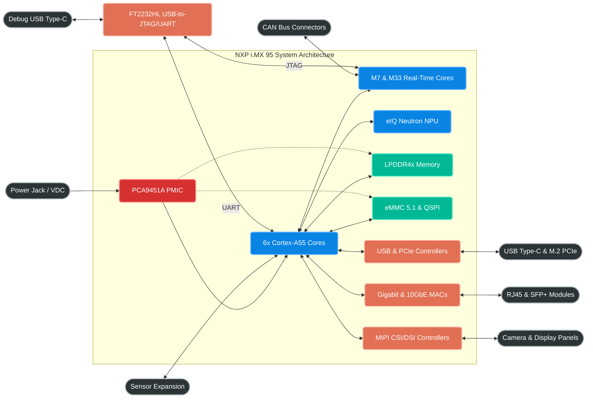

# NXP i.MX 95 System Architecture

## Part Selection
**Selected Part:** `MIMX9536CVZXNAC` (NXP i.MX 95)
- **Cores:** Hexa-core Arm Cortex-A55 @ 1.8 GHz
- **Real-Time Domains:** Cortex-M7 & Cortex-M33
- **NPU:** eIQ Neutron NPU (~2 TOPS)
- **Package:** 19 x 19 mm FC-PBGA
- **Pitch:** 0.7 mm
- **Temperature:** Industrial (-40°C to 105°C)

### Why This Was Chosen
We initially evaluated the i.MX 8M Plus, but pivoted to the i.MX 95 series to gain the modern Cortex-A55 architecture. Crucially, we specifically targeted the **"Z" package (19x19 mm)**. 
- **PCB Manufacturability:** The 19x19 mm package has a highly forgiving **0.7 mm BGA pitch**. Combined with JLCPCB's free Via-in-Pad (POFV) on 6-10 layer boards, routing this chip will be incredibly easy and won't require expensive High-Density Interconnect (HDI) manufacturing.
- **Performance:** It easily exceeds our robotics requirements with six A55 cores and dual real-time microcontrollers, ensuring precise motor control and heavy vision processing simultaneously.

### Vendor Links & Sourcing Strategy
Because the i.MX 95 is a cutting-edge processor, it is generally **not** found in LCSC's native catalog. (Note: `MIMX9536CVTXNBC` is the 15x15mm 0.5mm pitch package which we are avoiding. We are specifically using the `MIMX9536CVZXNAC` 19x19mm 0.7mm pitch package).
- **Procurement Strategy:** Since LCSC does not natively stock this yet, we will procure it from **Mouser** or **DigiKey** and use JLCPCB's **Global Sourcing / Consignment** feature to have them assemble it on the board.
- **Mouser Page (Exact Z-Package):** [Mouser MIMX9536CVZXNAC](https://www.mouser.com/ProductDetail/NXP-Semiconductors/MIMX9536CVZXNAC)
- **DigiKey Page (Exact Z-Package):** [DigiKey MIMX9536CVZXNAC](https://www.digikey.com/en/products/detail/nxp-usa-inc/MIMX9536CVZXNAC/22137978)
- **NXP Product Page:** [i.MX 95 Product Page](https://www.nxp.com/products/processors-and-microcontrollers/arm-processors/i-mx-applications-processors/i-mx-9-processors/i-mx-95-family-high-performance-safety-enabled-applications-processor:i.MX95)
- **Hardware Design Guide:** [i.MX 95 Hardware Developer's Guide](https://www.nxp.com/) *(Requires NXP Login. See Section 4 for LPDDR4x layout guidelines and Section 5 for Power/PMIC mapping).*

---

---

## Programming & Debugging Methodology

Programming an NXP i.MX processor from a blank, factory-fresh state requires specific interfaces. We will design the board to support both modern USB flashing and traditional JTAG debugging.

### 1. Initial Flashing (The NXP USB Serial Downloader)
When the i.MX 95 boots with a blank eMMC/Flash, its Boot ROM fails to find a valid OS. It automatically falls back to **Serial Downloader Mode** (SDP). 
- **How it works:** In this mode, the SoC enumerates as a USB HID device on a host PC connected to its `USB1` (USB OTG/Type-C) port. 
- **The Tool:** We will use NXP's **Universal Update Utility (UUU)** running on a host computer.
- **The Process:** UUU pushes a tiny bootloader (U-Boot) into the SoC's internal RAM over USB and executes it. This temporary bootloader then exposes the eMMC and QSPI flash to the host PC, allowing UUU to permanently flash the full Linux OS and bootloader to the eMMC.
- **Hardware Requirement:** We *must* expose the `USB1` interface as a Type-C or Micro-B port, and route the `BOOT_MODE` pins to physical switches or pull-resistors so we can force Serial Downloader mode if the eMMC ever gets corrupted.

### 2. Low-Level Debugging & Serial Console (FTDI)
Do we need a USB-to-JTAG chip directly on the board? 
- **Recommendation:** **Yes, we will integrate an FTDI FT2232HL (Dual Channel USB-to-UART/FIFO).** 
- **Why:** Because this board is for development and low-volume robotics (not hyper-optimized mass consumer production), ease-of-use is a massive priority. Putting an FTDI chip directly on the board allows developers to just plug in a single USB cable and instantly get both a **Serial UART Console** (for Linux/U-Boot logs) and a **JTAG/SWD interface** (for bare-metal debugging).
- **Trade-offs:** It consumes more PCB space and adds a few dollars to the BOM, but completely eliminates the need for expensive external hardware debuggers (like Segger J-Link or proprietary MCU-Links) and makes out-of-the-box configuration vastly easier.

### 3. Memory Configuration
- **Boot ROM Config:** We will place a **QSPI or Octa-SPI NOR Flash** on the board. The Boot ROM will be configured via boot pins to load U-Boot from this SPI flash.
- **Main Storage:** The OS (Linux) and root filesystem will reside on the **eMMC 5.1** chip. 
- **Why split them?** Putting the bootloader on isolated SPI flash prevents the board from becoming "bricked" if the eMMC gets corrupted during a Linux update. 

## Next Steps for Schematic Capture
1. Select the specific PMIC (Power Management IC) recommended by NXP for the i.MX 95.
2. Select LPDDR4x/LPDDR5 memory modules that match NXP's reference designs to ensure timing compatibility.
3. Design the Boot Mode strapping resistor network to allow forcing USB recovery mode.

---

## Recommended Supporting ICs & References
Selecting the right supporting components is critical for ensuring NXP BSP (Board Support Package) compatibility, meeting our mechanical size constraints, and avoiding software headaches. Here is the chip-level breakdown of what we need and *why*:

### 1. Power Management (PMIC) vs Discrete Supplies
- **Recommendation:** **NXP PCA9451A** (or the exact designated i.MX 9 companion PMIC) for the core SoC rails.
- **Why:** The i.MX 95 requires strict, complex power-up/power-down sequencing (e.g., core voltage first, then I/O, then memory). A dedicated companion PMIC handles this internally via pre-programmed OTP (One-Time Programmable) memory and interfaces via I2C for dynamic voltage scaling (DVS) to save power.
- **Trade-offs & BOM Consolidation:** While a highly integrated PMIC is excellent for the SoC core, it can be expensive and has a large BGA footprint. For peripheral power (e.g., 5V for USB, 3.3V for sensors), we will **not** use massive PMICs. Instead, we use a **repeating discrete supply strategy**: we select a single, cheap, high-efficiency synchronous buck converter (e.g., Texas Instruments TLV62568) and use it multiple times across the board. By simply changing the feedback resistors, we get different voltages. This adds slightly more passive components, but massively consolidates our BOM, reduces supply chain risk, and lowers cost.
- **Link:** [NXP PMIC Portfolio](https://www.nxp.com/products/power-management/pmics-and-sbcs:PMICS-AND-SBCS)

### 2. Main Memory (LPDDR4x)
- **Recommendation:** **Micron MT53E series** (e.g., 2GB or 4GB LPDDR4x, 200-ball VFBGA) or equivalent **Samsung / SK Hynix** automotive-grade memory.
- **Why:** To run a full Linux stack and AI vision models, we need high bandwidth. LPDDR4x offers massive bandwidth at lower power than standard DDR4.
- **Trade-offs:** LPDDR5 is faster, but LPDDR4x is cheaper, perfectly adequate for the i.MX 95, and routing a 200-ball BGA is mechanically easier on a 6-10 layer board. Crucially, Micron and Samsung are the "golden standard" used in NXP's DDR stress tools. Using them prevents us from having to manually calculate complex DDR timing parameters from scratch.
- **Datasheet Ref:** See **i.MX 95 Hardware Developer’s Guide, Section 4 (LPDDR4x Routing Guidelines)** for exact impedance and length matching rules.
- **Link:** [Micron LPDDR4](https://www.micron.com/products/dram/lpdram/lpddr4-lpddr4x) | [Search on LCSC](https://www.lcsc.com/products/DRAM_11239.html)

### 3. Mass Storage (eMMC 5.1)
- **Recommendation:** **SanDisk/Western Digital iNAND** or **Kioxia (Toshiba) THGBM series** (16GB - 32GB).
- **Why:** SD cards are notoriously unreliable for robotics experiencing heavy vibration. eMMC is soldered directly to the board and offers wear-leveling controllers built-in, making it incredibly robust for the Linux RootFS.
- **Trade-offs:** We could use a PCIe NVMe SSD for massive storage, but that consumes our only PCIe lane and takes up massive mechanical space (M.2 slot). eMMC 5.1 is tiny (11.5x13mm BGA), cheap, and fast enough (~400MB/s) for our OS requirements without eating up the PCIe bus.
- **Datasheet Ref:** See **i.MX 95 Datasheet, USDHC (Ultra High Speed Dual Host Controller) Electrical Characteristics** for max clock speeds.
- **Link:** [Kioxia eMMC](https://europe.kioxia.com/en-europe/business/memory/mlc-nand/emmc.html)

### 4. Configuration Boot Flash (QSPI/Octa-SPI)
- **Recommendation:** **Macronix MX25L / MX25U series** or **Winbond W25Q series** (16MB - 32MB).
- **Why:** If the eMMC fails or the Linux OS gets corrupted, the board is bricked. We mitigate this by storing the microscopic bootloader (U-Boot/ATF) on an isolated, highly reliable SPI NOR flash chip. The i.MX 95 Boot ROM natively supports Macronix over the FlexSPI controller.
- **Trade-offs:** Adding a secondary flash chip adds ~$1 to the BOM and takes up a small 8-WSON footprint. However, the architectural safety of having an un-brickable bootloader that can re-flash the eMMC over USB is well worth the space and cost.
- **Datasheet Ref:** See **i.MX 95 Reference Manual, FlexSPI Controller Chapter** and the **System Boot Chapter** for supported NOR flash vendors.
- **Link:** [Macronix NOR Flash](https://www.macronix.com/en-us/products/NOR-Flash/Pages/default.aspx)

### 5. On-Board Debugger (USB-to-JTAG/UART)
- **Recommendation:** **FTDI FT2232HL** (Dual Channel High-Speed USB to Multipurpose UART/FIFO).
- **Why:** Integrating this chip allows us to expose a single Micro-USB or Type-C "Debug Port". One channel acts as the standard Serial Console (UART) for Linux, and the other channel acts as an OpenOCD-compatible JTAG debugger. 
- **Trade-offs:** Adds ~$5 cost and takes up footprint space, but eliminates the need for developers to buy external hardware debug probes, vastly improving the out-of-the-box development experience.

### 6. Flashing Tool (NXP UUU)
- **Tool:** **mfgtools (Universal Update Utility - UUU)**
- **Why:** The official, open-source tool from NXP for pushing firmware over USB to a blank board. It eliminates the need for expensive JTAG programmers in production.
- **Link:** [NXP mfgtools GitHub Repository](https://github.com/nxp-imx/mfgtools)

### 7. High-Speed Switches / PHYs (Ethernet & USB)
- **Ethernet PHY:** **Microchip KSZ9131** or **Realtek RTL8211F** (Gigabit Ethernet PHYs with RGMII). These are industry standards with mainline Linux driver support, ensuring the Ethernet ports "just work" on boot.
- **USB Hub:** If the mechanical constraints of the robotics platform require more than the native USB ports, we will use a **Microchip USB2514B**.
- **Trade-offs:** Every external PHY adds significant power draw and routing complexity. We will carefully evaluate if the robotics use-case requires dual Ethernet ports before placing a second PHY, to save PCB real estate and power.
