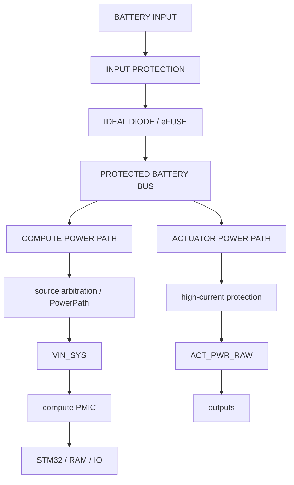
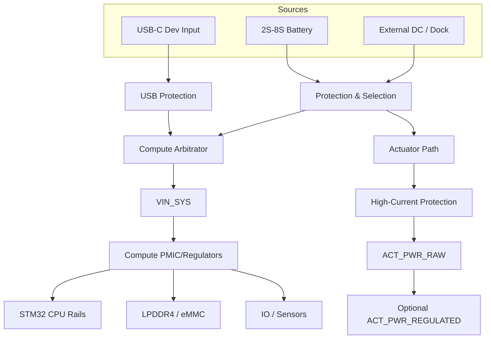

# Power Architecture

This is the master power architecture document for the universal robotics controller based on the STM32MP257.

## Battery Input Envelope

**DESIGN CHOICE**: The system targets 2S through 8S battery input.

| Chemistry | Series Count | Vcell Min | Vcell Nominal | Vcell Max | Pack Min | Pack Nominal | Pack Max | Expected Transient/Surge | Reverse Polarity Case | Expected Current | Connector Rating | Source Impedance |
| :--- | :--- | :--- | :--- | :--- | :--- | :--- | :--- | :--- | :--- | :--- | :--- | :--- |
| Li-ion/LiPo | 2S | 3.0V | 3.7V | 4.2V | 6.0V | 7.4V | 8.4V | TBD | TBD | TBD - REQUIRES <missing param> | TBD | TBD - REQUIRES <missing param> |
| Li-ion/LiPo | 3S | 3.0V | 3.7V | 4.2V | 9.0V | 11.1V | 12.6V | TBD | TBD | TBD - REQUIRES <missing param> | TBD | TBD - REQUIRES <missing param> |
| Li-ion/LiPo | 4S | 3.0V | 3.7V | 4.2V | 12.0V | 14.8V | 16.8V | TBD | TBD | TBD - REQUIRES <missing param> | TBD | TBD - REQUIRES <missing param> |
| Li-ion/LiPo | 5S | 3.0V | 3.7V | 4.2V | 15.0V | 18.5V | 21.0V | TBD | TBD | TBD - REQUIRES <missing param> | TBD | TBD - REQUIRES <missing param> |
| Li-ion/LiPo | 6S | 3.0V | 3.7V | 4.2V | 18.0V | 22.2V | 25.2V | TBD | TBD | TBD - REQUIRES <missing param> | TBD | TBD - REQUIRES <missing param> |
| Li-ion/LiPo | 7S | 3.0V | 3.7V | 4.2V | 21.0V | 25.9V | 29.4V | TBD | TBD | TBD - REQUIRES <missing param> | TBD | TBD - REQUIRES <missing param> |
| Li-ion/LiPo | 8S | 3.0V | 3.7V | 4.2V | 24.0V | 29.6V | 33.6V | TBD | TBD | TBD - REQUIRES <missing param> | TBD | TBD - REQUIRES <missing param> |
| LiFePO4 | 2S | 2.5V | 3.2V | 3.65V | 5.0V | 6.4V | 7.3V | TBD | TBD | TBD - REQUIRES <missing param> | TBD | TBD - REQUIRES <missing param> |
| LiFePO4 | 3S | 2.5V | 3.2V | 3.65V | 7.5V | 9.6V | 10.95V| TBD | TBD | TBD - REQUIRES <missing param> | TBD | TBD - REQUIRES <missing param> |
| LiFePO4 | 4S | 2.5V | 3.2V | 3.65V | 10.0V | 12.8V | 14.6V | TBD | TBD | TBD - REQUIRES <missing param> | TBD | TBD - REQUIRES <missing param> |
| LiFePO4 | 5S | 2.5V | 3.2V | 3.65V | 12.5V | 16.0V | 18.25V| TBD | TBD | TBD - REQUIRES <missing param> | TBD | TBD - REQUIRES <missing param> |
| LiFePO4 | 6S | 2.5V | 3.2V | 3.65V | 15.0V | 19.2V | 21.9V | TBD | TBD | TBD - REQUIRES <missing param> | TBD | TBD - REQUIRES <missing param> |
| LiFePO4 | 7S | 2.5V | 3.2V | 3.65V | 17.5V | 22.4V | 25.55V| TBD | TBD | TBD - REQUIRES <missing param> | TBD | TBD - REQUIRES <missing param> |
| LiFePO4 | 8S | 2.5V | 3.2V | 3.65V | 20.0V | 25.6V | 29.2V | TBD | TBD | TBD - REQUIRES <missing param> | TBD | TBD - REQUIRES <missing param> |
| Li-ion HV | 2S | 3.0V | 3.7V | 4.35V | 6.0V | 7.4V | 8.7V | TBD | TBD | TBD - REQUIRES <missing param> | TBD | TBD - REQUIRES <missing param> |
| Li-ion HV | 3S | 3.0V | 3.7V | 4.35V | 9.0V | 11.1V | 13.05V| TBD | TBD | TBD - REQUIRES <missing param> | TBD | TBD - REQUIRES <missing param> |
| Li-ion HV | 4S | 3.0V | 3.7V | 4.35V | 12.0V | 14.8V | 17.4V | TBD | TBD | TBD - REQUIRES <missing param> | TBD | TBD - REQUIRES <missing param> |
| Li-ion HV | 5S | 3.0V | 3.7V | 4.35V | 15.0V | 18.5V | 21.75V| TBD | TBD | TBD - REQUIRES <missing param> | TBD | TBD - REQUIRES <missing param> |
| Li-ion HV | 6S | 3.0V | 3.7V | 4.35V | 18.0V | 22.2V | 26.1V | TBD | TBD | TBD - REQUIRES <missing param> | TBD | TBD - REQUIRES <missing param> |
| Li-ion HV | 7S | 3.0V | 3.7V | 4.35V | 21.0V | 25.9V | 30.45V| TBD | TBD | TBD - REQUIRES <missing param> | TBD | TBD - REQUIRES <missing param> |
| Li-ion HV | 8S | 3.0V | 3.7V | 4.35V | 24.0V | 29.6V | 34.8V | TBD | TBD | TBD - REQUIRES <missing param> | TBD | TBD - REQUIRES <missing param> |

**THEORY**: Components exposed to raw battery must have headroom above max steady-state for: hot plug, wiring inductance, regenerative loads, actuator braking, motor-controller transients, connector arcing, and supply overshoot. 

**DATASHEET REQUIREMENT**: The required transient rating must be determined from the actual environment.

## Power Architecture Block Diagram

**DESIGN CHOICE**: Compute and actuator paths must be separated. Actuators generate extreme electrical noise, large ground bounce, and severe voltage transients during braking or high-torque events. If compute and actuator share the same power regulation path, these transients can violate the PMIC input specifications or couple into sensitive STM32 rails, leading to brown-outs, spontaneous resets, or sensor data corruption.

## PowerPath Part Evaluation

**PROPOSED - NEEDS CALCULATION, NEEDS SIMULATION, NEEDS LCSC VERIFICATION**

### C1: LM7480 / LM7480-Q1 Class
- **Description**: 3-65V ideal-diode controller
- **External**: External back-to-back N-channel MOSFETs
- **Features**: reverse polarity protection, reverse current blocking, ideal-diode behavior, overvoltage protection, external MOSFET scalability
- **Note**: NOT automatically a complete source-priority mux. Evaluate for 2S-8S compute power path.

### C2: TPS4811-Q1 Class
- **Description**: Wide-voltage smart high-side controller
- **External**: External MOSFETs, current measurement, overcurrent/short-circuit protection
- **Note**: Evaluate for high-current actuator pass-through, protected battery output, power distribution, electronic fuse. Do NOT lock until LCSC sourcing verified.

### C3: Other Options

| Part | Manufacturer | VIN Range | Features | External FET | LCSC | Status |
| :--- | :--- | :--- | :--- | :--- | :--- | :--- |
| TBD - REQUIRES <missing param> | TI/ADI/ST/Infineon/MPS/onsemi | >=40V | Reverse-current blocking, programmable UVLO/OVP, inrush control | Yes | TBD | PROPOSED - NEEDS LCSC VERIFICATION |
| TBD - REQUIRES <missing param> | TI/ADI/ST/Infineon/MPS/onsemi | >=40V | Thermal protection, fault outputs | Yes | TBD | PROPOSED - NEEDS LCSC VERIFICATION |

*Research and selection of specific part numbers from other vendors are TBD.*

## Actuator Power Architecture

**DESIGN CHOICE**: `ACT_PWR_RAW` vs `ACT_PWR_REGULATED` distinction.
`ACT_PWR_RAW` is approximately battery voltage after protection (up to ~33.6V for 8S Li-ion or ~34.8V for 8S HV).

**THEORY**: Many servos CANNOT tolerate this voltage. 
Possible regulated actuator rails: 5V, 6V, 7.4V, 8.4V, 12V, configurable.

**TBD - REQUIRES <missing param>**: Do NOT select final regulator until servo voltage, current, power, and thermal constraints are defined. Evaluate whether regulated power belongs on motherboard, daughterboard, or external module.

## Emergency Actuator Disconnect

**DESIGN CHOICE**: Architecture where ACTUATOR POWER can be disconnected while COMPUTE remains alive. This enables ESTOP, fault shutdown, debugging, and maintaining a safe state. 
**DATASHEET REQUIREMENT**: The processor should observe actuator-power state. 

*Note: Do NOT claim functional safety certification. This design has not been evaluated for formal SIL/ASIL ratings.*

## USB-C Power Boundary

**DESIGN CHOICE**: USB-C development power defaults to COMPUTE ONLY.
**THEORY**: Must prevent battery->USB backfeed and actuator->USB backfeed to protect the developer's PC and the USB-C source.

## External Supply / Dock Power

**DESIGN CHOICE**: The system supports `DOCK_COMPUTE_ONLY` vs `DOCK_FULL_POWER` capability classes.

## Regenerative Energy

**THEORY**: Motors/actuators may return energy.
**DESIGN CHOICE**: System must account for reverse-current blocking, bus voltage rise, TVS/clamp, braking resistor, ESC behavior, and battery absorption.

## Power Tree Detail

