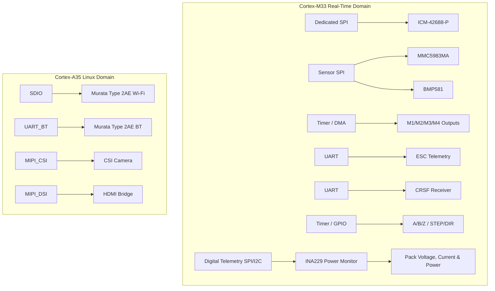

# Sensor and I/O Architecture

This document describes the primary real-time sensor, motor, and expansion interfaces for the Universal Robotics Controller. High-bandwidth computing elements (PCIe, Ethernet, MIPI) are handled by the Cortex-A35 Linux domain, while this document primarily focuses on deterministic payloads owned by the Cortex-M33.

## Architectural Philosophy
The core design separates fundamental low-latency navigation logic (IMU, mag, baro) directly onto the motherboard, while delegating high-power elements (3-phase inverters) or specialized analog (resolver, load cell) to daughterboards.

## Onboard Sensors

### 1. Primary IMU: TDK InvenSense ICM-42688-P
- **Interface:** Dedicated SPI (owned by Cortex-M33). Do not share this bus to preserve minimum latency and maximum polling rate.
- **Signals:** SPI (SCLK, MOSI, MISO, CS), INT1, INT2.
- **Power:** Driven by `3V3_SENSOR` (TI TPS7A2033PDBVR).
- **Layout Requirements:** Mechanically isolated from thermal/vibrational sources, PMIC, switching inductors, Ethernet PHYs, and the Wi-Fi RF section.

### 2. Magnetometer: MEMSIC MMC5983MA
- **Interface:** Secondary Sensor SPI (owned by Cortex-M33).
- **Signals:** SPI (shared SCLK, MOSI, MISO), Dedicated CS, DRDY/INT.
- **Layout Requirements:** Near board edge, maximum distance from inductors, PMIC, and motor current paths.
- **Note:** An external magnetometer option is maintained for UAVs where the onboard magnetic environment is compromised.

### 3. Barometer: Bosch BMP581
- **Interface:** Secondary Sensor SPI (shared with Magnetometer).
- **Signals:** SPI (shared), Dedicated CS, INT.
- **Layout Requirements:** Requires exposed pressure port, no conformal coating over the opening, and thermal isolation from the SoC/PMIC.

## Motor & Actuator Interfaces

### 4-in-1 ESC Interface
Provides standard control for quadcopters or mobile robots using integrated ESCs.
- **Signals:** M1, M2, M3, M4 (PWM/DShot capable, M33 timer/DMA owned), ESC_TELEM (UART), VBAT_SENSE (ADC), CURRENT_SENSE (ADC), GND, optional 5V/Aux.
- **Isolation:** No BLDC motor phase current routes through the motherboard.

### General BLDC / Servo Daughterboard Support
Designed to connect to external driver boards (e.g., TI DRV8353).
- **Signals:** Complementary PWM (STEP/DIR or direct), enable, fault, SPI configuration, current-sense ADCs, and encoder feedback.

### Encoders & Actuators
- **Incremental Encoders:** Differential (A+, A-, B+, B-, Z+, Z-) hardware quadrature decoder inputs.
- **Absolute Encoders:** SPI/SSC (e.g., Infineon TLE5012B-E1000).
- **STEP/DIR:** Protected/buffered interfaces for external industrial stepper/servo drives.
- **Resolver / Load Cell:** Offloaded to daughterboards via expansion SPI and DRDY pins (e.g., AD2S1210 for resolver, ADS1235 for load cells).

## Navigation & Wireless

- **GNSS/GPS:** UART (TX, RX), PPS (mapped to a low-latency timer/interrupt), power, GND.
- **ExpressLRS (CRSF):** Dedicated Cortex-M33 UART running at >420 kbaud.
- **Wi-Fi/Bluetooth:** Murata Type 2AE (LBEE5PK2AE-564). SDIO for Wi-Fi, UART for Bluetooth HCI.

### Wi-Fi Antenna Strategy
The board will not use a fixed chip antenna. The design specifies a manufacturer-recommended matching network leading to a selection point: either a grounded coplanar waveguide PCB antenna or a U.FL connector. Final antenna dimensions depend on the board outline and enclosure.

## Expansion & Industrial Interfaces

- **External SPI & I2C:** Breakouts available for short-cable local expansion.
- **True CO2:** Supported via a slow UART/I2C daughterboard (e.g., Senseair Sunrise).
- **Industrial I/O:** (See `industrial-io.md`) Includes IO-Link, RS-485, 24V I/O, and isolated CAN.

## Clean Sensor Power (3V3_SENSOR)
To guarantee high performance from the ICM-42688-P and MMC5983MA, a dedicated low-noise LDO (TI TPS7A2033PDBVR, 3.3V, 300mA) establishes the `3V3_SENSOR` rail. This rail features high PSRR to reject conducted noise from the PMIC and is physically separated from high-current switching regulators. It does NOT power Wi-Fi, Ethernet, or external USB devices.

## Noise & EMC Mitigation
- **Sensors:** Clean power, local decoupling, short SPI trace lengths, source termination.
- **Motors:** Separate high-current paths, no phase current on PCB, protected ADC filtering.
- **RF:** Controlled 50-ohm impedance, antenna keepouts, continuous ground planes.

## Conceptual Bus Architecture

