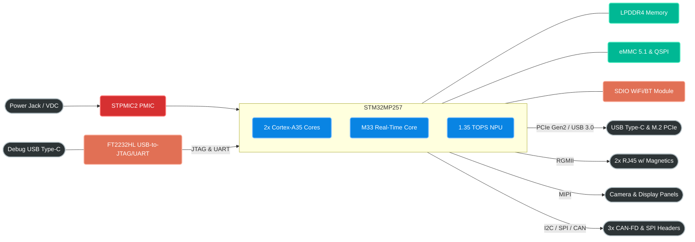

# STMicroelectronics STM32MP257 System Architecture

## Part Selection
**Selected Part:** [STM32MP257 (STMicroelectronics)](https://www.st.com/en/microcontrollers-microprocessors/stm32mp257d.html) - [View Datasheet](../../references/datasheets/STM32MP257.pdf)
- **Cores:** Dual-core Arm Cortex-A35 @ 1.5 GHz
- **Real-Time Domain:** Cortex-M33 @ 400 MHz
- **NPU:** Integrated Neural Processing Unit (1.35 TOPS)
- **GPU:** 3D GPU (VeriSilicon Vivante) & Image Signal Processor (ISP)
- **Package:** VFBGA436 (0.5 mm pitch) or TFBGA436 (0.8 mm pitch)

### Why This Was Chosen (The Pivot from NXP)
We initially bounced between the NXP i.MX 95 and i.MX 8M Plus. However, NXP's aggressive use of Non-Disclosure Agreements (NDAs) for hardware design guides, combined with CDN firewalls that block automated datasheet retrieval, makes open-source hardware design immensely frustrating. 

We pivoted to the **STM32MP257** because:
1. **World-Class Public Documentation:** ST's datasheets, reference manuals, and the massive STM32 Wiki are completely open and accessible.
2. **Superior Economics:** ST components are historically more cost-effective, and the PMIC requirements are generally simpler and cheaper.
3. **Robotics Dream Specs:** It features exactly what we need—an AI NPU (1.35 TOPS), an M33 Real-Time core, PCIe Gen2, USB 3.0, 3x CAN-FD, and Dual Gigabit Ethernet.

---

## High-Level Block Diagram

---

## Programming & Debugging Methodology

### 1. Initial Flashing (STM32CubeProgrammer)
When the STM32MP25 boots with a blank eMMC/Flash, it falls back to a serial bootloader mode via USB. We use the **STM32CubeProgrammer** to flash the Trusted Firmware-A (TF-A), U-Boot, and Linux rootfs directly to the eMMC.

### 2. Low-Level Debugging & Serial Console (FTDI)
- **Recommendation:** **We will integrate an FTDI FT2232HL (Dual Channel USB-to-UART/FIFO).** 
- **Why:** Ease-of-use is a massive priority. Putting an FTDI chip directly on the board allows developers to plug in a single USB cable and instantly get both a **Serial UART Console** (for Linux/U-Boot logs) and a **JTAG interface** (for bare-metal debugging).

## Recommended Supporting ICs (LCSC Sourcing Locked)

To strictly satisfy the **LCSC Native Sourcing Mandate (SYS-002)** and minimize BOM cost, the following highly-available, economic ICs have been selected:

| Subsystem | Part Number | Capacity / Specs | LCSC Part | Datasheet |
| :--- | :--- | :--- | :--- | :--- |
| **SoC** | STM32MP257F | Dual A35, M33, 1.35 TOPS | [Search LCSC](https://www.lcsc.com/search?q=STM32MP257) | [STM32MP257.pdf](../../references/datasheets/STM32MP257.pdf) |
| **PMIC** | STPMIC25 | Companion PMIC for MP2 | [Search LCSC](https://www.lcsc.com/search?q=STPMIC25) | [AN5727 Guide](https://www.st.com/resource/en/application_note/an5727-how-to-use-stpmic25-for-a-wall-adapter-powered-application-on-stm32mp25-mpus-stmicroelectronics.pdf) |
| **LPDDR4 (2x)** | Micron MT53E512M32D1ZW | 16 Gbit (2 GigaBytes), Fly-By Topology (4GB Total) | [C5330502](https://www.lcsc.com/product-detail/LPDDR_Micron-Tech-MT53E512M32D1ZW-046-IT-B_C5330502.html) | [Micron Portal](https://www.micron.com/products/dram/lpdram) |
| **LPDDR4 (8GB Alt)** | Micron MT53E1G32D2FW | 32 Gbit (4 GigaBytes), Fly-By Topology (8GB Total) | [C20451088](https://www.lcsc.com/search?q=MT53E1G32D2FW) | [Micron Portal](https://www.micron.com/products/dram/lpdram) |
| **eMMC** | FORESEE FEMDRW064G | 64GB eMMC 5.1 | [C719927](https://www.lcsc.com/product-detail/eMMC_FORESEE-FEMDRW064G-88A19_C719927.html) | [FORESEE Web](https://www.longsys.com) |
| **QSPI NOR** | Winbond W25Q256JVFIQ | 32MB QSPI (3.3V) | [C779876](https://www.lcsc.com/product-detail/NOR-FLASH_Winbond-Elec-W25Q256JVFIQ_C779876.html) | [W25Q256JVFIQ.pdf](../../references/datasheets/W25Q256JVFIQ.pdf) |
| **Eth PHY (2x)**| TI DP83867IRRGZR | Gigabit RGMII (1.8V IO) | [C2678038](https://www.lcsc.com/product-detail/Ethernet-ICs_Texas-Instruments-DP83867IRRGZR_C2678038.html) | [DP83867IR.pdf](../../references/datasheets/DP83867IRRGZR.pdf) |
| **CAN-FD (3x)** | TI TCAN1044AVDRQ1 | 8 Mbps, 1.8V VIO Pin | [C3234993](https://www.lcsc.com/product-detail/CAN-ICs_Texas-Instruments-TCAN1044AVDRQ1_C3234993.html) | [TCAN1044AV.pdf](../../references/datasheets/TCAN1044AVDRQ1.pdf) |
| **JTAG/UART** | FTDI FT2232HL-REEL | Dual USB-to-UART/FIFO | [C46808](https://www.lcsc.com/product-detail/USB-ICs_FTDI-Future-Technology-Devices-International-FT2232HL-REEL_C46808.html) | [FTDI Web](https://ftdichip.com/products/ft2232hq/) |
| **WiFi / BT** | Ampak AP6256 | 802.11ac Wi-Fi & BT 5.0 (SDIO/UART) | [C2843076](https://www.lcsc.com/search?q=AP6256) | [Ampak Portal](http://www.ampak.com.tw) |
| **USB HS PHY** | *Integrated in SoC* | STM32MP257 has embedded PHYs | N/A | See Datasheet Section 3.58 |

### Design Rationale for LCSC Selections
1. **Memory Capacity:** By routing two 16-bit chips in a **Fly-By Topology**, we easily achieve a massive **4GB of total system RAM** using the heavily stocked and incredibly cheap 2GB modules (`C5330502`). Furthermore, because the Fly-by topology is inherently modular, we can drop-in replace those with 4GB chips to hit an astronomical **8GB of total system RAM** for heavy local LLM/vision processing, at the cost of pushing the PCB to 8 layers.
2. **Cost-Effective Sourcing:** The FT2232HL (C46808) and Winbond W25Q256 (C779876) are ubiquitous "Extended" parts on JLCPCB, meaning they are incredibly cheap to assemble.
3. **No Level Shifters:** The TI TCAN1044A (C3234993) and DP83867 Ethernet PHY (C2678038) both support native 1.8V logic interfacing. We save routing space and BOM cost by entirely eliminating the need for digital level shifters.
