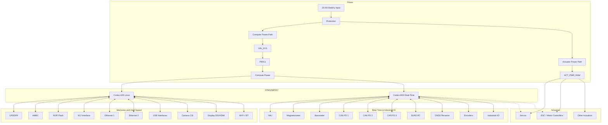

# System Block Diagram

This document illustrates the comprehensive block diagram for the universal robotics controller based on the STM32MP257.

**THEORY**: The compute and actuator power paths must remain physically and logically separated until the point of main distribution to prevent actuator noise from compromising compute stability.
