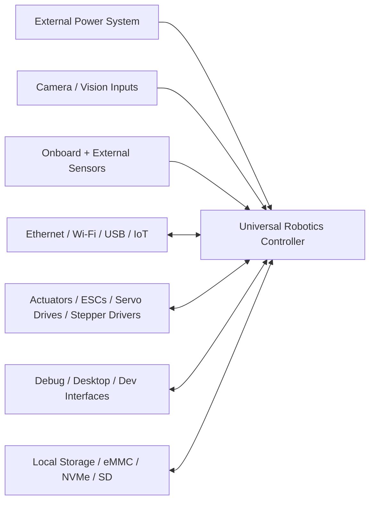
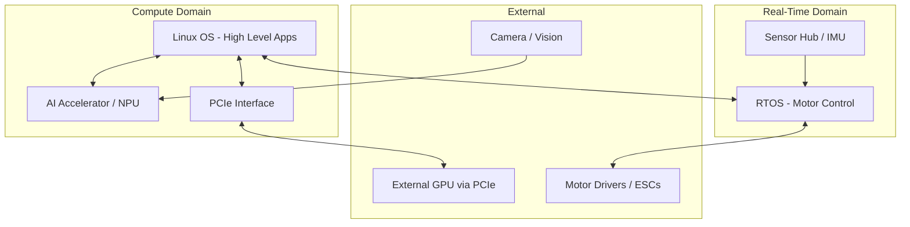

# System Architecture Overview

## High-Level System Block Diagram

This is the broadest view of the system: the board as a universal robotics brain.

## Internal Architecture

## PCIe Acceleration Note
As robotics applications increasingly rely on foundation models and complex 3D perception, the onboard NPU may not suffice for all use cases. Therefore, the architecture incorporates **PCIe** to allow the connection of an external GPU later for heavier acceleration workloads.

## Core Modules
- **Application Processor:** Manages ROS2, networking, and user logic.
- **Co-Processor / MCU:** Handles tight timing loops, safety overrides, and PID controllers.
- **Vision Pipeline:** Dedicated ISP and MIPI CSI lanes for camera ingestion.
